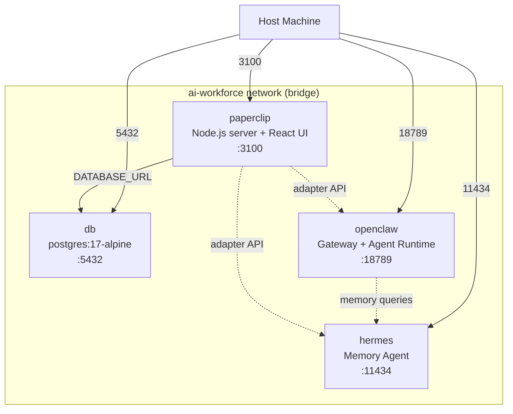

# AI Workforce Orchestration — Multi-Container Docker Compose Architecture

## Background

We are building a local AI workforce using Docker Compose to orchestrate three distinct services on a shared internal network. Each service has a clearly defined role:

| Service | Role | Image Source | Default Port |
|---|---|---|---|
| **Paperclip** | Management/Control Plane — org charts, budgets, governance, dashboard | `paperclipai/paperclip` repo (builds from Dockerfile) | `3100` |
| **OpenClaw** | Execution/Gateway — tool execution, multi-channel messaging, WebSocket gateway | `openclaw/openclaw` (official image) | `18789` |
| **Hermes** | Persistent Memory/Learning — `MEMORY.md`, `USER.md`, SQLite FTS5, self-improving skills | `nousresearch/hermes-agent` (official image) | `11434` |

All three share a single `ai-workforce` bridge network for internal DNS-based service discovery (`hermes`, `openclaw`, `paperclip`). External traffic is port-mapped to the host. Each service gets its own persistent named volume.

---

## User Review Required

> [!IMPORTANT]
> **API Keys:** The `.env` file will template slots for `ANTHROPIC_API_KEY`, `OPENAI_API_KEY`, and optionally model-specific keys. You will need to supply at least one working key before `docker compose up`.

> [!WARNING]
> **Docker Socket Mounting:** OpenClaw uses Docker-in-Docker for sandboxed tool execution. The compose file mounts `/var/run/docker.sock` into the `openclaw` container. This grants it host-level Docker access — standard for self-hosted agent runtimes but understand the security implications.

> [!IMPORTANT]
> **Image Tags:** The plan uses `:latest` for OpenClaw and Hermes as no stable release tags have been confirmed. Please confirm if you prefer pinned versions or specific tags.

---

## Open Questions

> [!IMPORTANT]
> **Q1: OpenClaw image registry** — The official Docker Hub image for OpenClaw may be `openclaw/openclaw:latest` or a GitHub Container Registry path like `ghcr.io/openclaw/openclaw`. Which registry/tag do you use, or should I default to the GitHub-based one?

> [!IMPORTANT]
> **Q2: Hermes image registry** — Similarly, Hermes Agent may be at `nousresearch/hermes-agent:latest` or a custom build. Which image source should we use?

> [!IMPORTANT]
> **Q3: Host paths for volumes** — The plan uses Docker named volumes (`paperclip_pgdata`, `hermes_data`, `openclaw_data`). Would you prefer bind mounts to specific host directories (e.g., `~/ai-workforce/hermes-data`) for easier backup/inspection?

> [!IMPORTANT]
> **Q4: Paperclip build vs. prebuilt image** — The upstream repo has a `Dockerfile` for building from source. Should we clone the repo and build locally, or is there a published Docker image you'd prefer to pull?

---

## Proposed Changes

### Component 1: Project Scaffold

#### [NEW] [CLAUDE.md](file:///Users/promo.warriors/Documents/cognato2/CLAUDE.md)
Already created — the master configuration and orchestration rules for this project.

#### [NEW] `.gitignore`
Standard ignores: `.env`, `node_modules/`, Docker build artifacts, local volumes.

---

### Component 2: Environment Configuration

#### [NEW] `.env.example`
Documented template with all required and optional environment variables:

```env
# ── Paperclip (Management Layer) ──────────────────────────
PAPERCLIP_PORT=3100
BETTER_AUTH_SECRET=<run: openssl rand -hex 32>
PAPERCLIP_PUBLIC_URL=http://localhost:3100
DATABASE_URL=postgres://paperclip:paperclip@db:5432/paperclip

# ── OpenClaw (Execution Layer) ────────────────────────────
OPENCLAW_PORT=18789
OPENCLAW_DATA_DIR=/data

# ── Hermes (Memory Layer) ─────────────────────────────────
HERMES_PORT=11434
HERMES_DATA_DIR=/root/.hermes

# ── Shared API Keys ───────────────────────────────────────
ANTHROPIC_API_KEY=
OPENAI_API_KEY=

# ── PostgreSQL ────────────────────────────────────────────
POSTGRES_USER=paperclip
POSTGRES_PASSWORD=paperclip
POSTGRES_DB=paperclip
POSTGRES_PORT=5432
```

#### [NEW] `.env`
Gitignored. User copies from `.env.example` and fills in secrets.

---

### Component 3: Docker Compose Architecture

#### [NEW] `docker-compose.yml`

Five services, one process per container, on a shared bridge network:



**Service definitions:**

| Service | Image / Build | Depends On | Healthcheck | Restart | Volumes |
|---|---|---|---|---|---|
| `db` | `postgres:17-alpine` | — | `pg_isready` (2s interval, 30 retries) | `unless-stopped` | `pgdata:/var/lib/postgresql/data` |
| `paperclip` | Build from cloned repo Dockerfile | `db` (healthy) | HTTP GET `:3100/api/health` | `unless-stopped` | `paperclip_home:/paperclip` |
| `openclaw` | Official image (TBD) | — | TCP check or HTTP health | `unless-stopped` | `openclaw_data:/data` |
| `hermes` | Official image (TBD) | — | TCP check or HTTP health | `unless-stopped` | `hermes_data:/root/.hermes` |

**Key design decisions:**

1. **One process per container** — strict Docker best practice. Paperclip server, OpenClaw gateway, Hermes agent, and PostgreSQL each run in their own isolated container.
2. **Health checks on every service** — `docker compose up` won't start dependents until the dependency is healthy.
3. **Named volumes** — data survives `docker compose down` (only destroyed with `docker compose down -v`).
4. **Bridge network** — services refer to each other by hostname (`db`, `paperclip`, `openclaw`, `hermes`). No hardcoded IPs.
5. **Restart policy: `unless-stopped`** — containers recover from crashes but respect manual stops.
6. **Fault isolation** — a crash in `hermes` doesn't take down `paperclip` or `openclaw`. Each service has independent restart behavior.

---

### Component 4: Paperclip Source (Git Submodule or Clone)

#### Strategy
Clone `paperclipai/paperclip` into `./services/paperclip/` and build from the existing `Dockerfile`. This gives us:
- Full control over the build
- Ability to customize adapter configurations
- The existing Dockerfile already handles the pnpm monorepo build

#### [NEW] `services/paperclip/` (git clone)
Cloned from `https://github.com/paperclipai/paperclip.git`.

---

### Component 5: Service-Specific Dockerfiles (if needed)

If official images exist for OpenClaw and Hermes, we use them directly. If not, we create minimal Dockerfiles:

#### [NEW] `services/openclaw/Dockerfile` (conditional)
Only if no official image exists. Would be a thin wrapper around the OpenClaw installation.

#### [NEW] `services/hermes/Dockerfile` (conditional)
Only if no official image exists. Would install Hermes Agent and configure the data directory.

---

### Component 6: Task & Lesson Tracking

#### [NEW] [tasks/lesson.md](file:///Users/promo.warriors/Documents/cognato2/tasks/lesson.md)
Checkable task list per CLAUDE.md workflow orchestration rules. Created alongside this plan.

---

## Verification Plan

### Automated Tests

1. **Docker Compose validation:**
   ```bash
   docker compose config
   ```
   Must parse without errors and show all 4 services with correct ports, volumes, and network.

2. **Service startup:**
   ```bash
   docker compose up -d
   docker compose ps
   ```
   All services must show `healthy` or `running` within 60 seconds.

3. **Health check probes:**
   ```bash
   curl -f http://localhost:3100/api/health    # Paperclip
   curl -f http://localhost:18789/health        # OpenClaw (TBD endpoint)
   curl -f http://localhost:11434/health        # Hermes (TBD endpoint)
   ```

4. **Inter-service connectivity:**
   ```bash
   docker compose exec paperclip ping -c 1 openclaw
   docker compose exec paperclip ping -c 1 hermes
   docker compose exec paperclip ping -c 1 db
   ```

5. **Volume persistence:**
   ```bash
   docker compose down
   docker volume ls | grep -E "pgdata|hermes_data|openclaw_data|paperclip_home"
   docker compose up -d
   # Verify data survived restart
   ```

6. **Fault isolation:**
   ```bash
   docker compose stop hermes
   curl -f http://localhost:3100/api/health  # Paperclip still responds
   docker compose start hermes
   ```

### Manual Verification
- Open Paperclip dashboard at `http://localhost:3100` and confirm the admin invite URL appears in logs
- Verify the OpenClaw gateway accepts WebSocket connections on port `18789`
- Verify Hermes data directory contains `MEMORY.md` and `USER.md` after first boot
